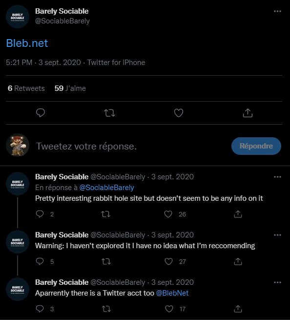

# Barely Musical

## First video

### Title

The title is 13 char long, the chars are not spaces
Using a [youtube title extractor](https://ytubetool.com/tools/youtube-title-and-description-generator) and
according to [this site](https://www.soscisurvey.de/tools/view-chars.php)
There are unprintable char (64 exactly) of 3 types :

- U+200F -> Right to left mark (RLM)
- U+200E -> Left to right mark (LRM)
- . (32 or 0x20) -> SPACE

Since the space numbers seems to vary
And the two unprintable chars have always the same pattern (RLM RLM LRM), let's replace this pattern by a dash and space by a dot (**morse**)

`-..-..-...-.-..-..-..-...-..-..-..-..-`

Not that, let's use RLM & LRM as separators :
`.. .. ... . .. .. .. ... .. .. .. ..`


### Description
___
<details>
    <summary>Description originale</summary>
    ```

    20536F6E67205469746C6520202D2053706F6F6B7920330D0A0D0A68747470733A2F2F6269742E6C792F334576394F635A


    436F6E677261747320796F7520666F756E642074686520626F6E757320636F64652E0D0A0D0A41726520796F75207375726520796F75207769736820746F20636F6E74696E75653F


    dWdnY2Y6Ly9jbmZncm92YS5wYnovNlRLdEdzbzYK
    ```
</details>

___

### Déchiffrage

>`20536F6E67205469746C6520202D2053706F6F6B7920330D0A0D0A68747470733A2F2F6269742E6C792F334576394F635A`
>
>Song Title  - Spooky 3
>
>https://bit.ly/3Ev9OcZ
>
___
>`436F6E677261747320796F7520666F756E642074686520626F6E757320636F64652E0D0A0D0A41726520796F75207375726520796F75207769736820746F20636F6E74696E75653F`
>
>Congrats you found the bonus code.
>
>Are you sure you wish to continue?
>
___
>`dWdnY2Y6Ly9jbmZncm92YS5wYnovNlRLdEdzbzYK`
>
> **base64**
>
>uggcf://cnfgrova.pbz/6TKtGso6
>
> **rot13**
>
>https://pastebin.com/6GXgTfb6
>
> Which gives :
>
>```
>Ok you figured out the next step,
>
>Figure out the next code and add it as a watch >code.
>
>https://www.youtube.com/watch?v=
>
>VGhlIHdhdGNoIGNvZGUgaXMgRGlzaXFjNC1SbVU=
>
> **base64**
>
>The watch code is Disiqc4-RmU
>
>https://www.youtube.com/watch?v=Disiqc4-RmU
>```

## Second video
### Description
___
<details>
<summary>Description originale</summary>


    124 150 145 40 156 145 167 40 163 151 154 153 40 162 157 141 144 40 166 151 144 145 157 40 167 151 154 154 40 142 145 40 162 145 154 145 141 163 145 144 40 164 150 145 40 63 162 144 40 167 145 145 153 40 157 146 40 156 157 166 145 155 142 145 162 56 40 111 164 40 164 157 157 153 40 141 40 162 145 141 154 154 171 40 154 157 156 147 40 164 151 155 145 40 142 145 143 141 165 163 145 40 111 40 150 141 144 40 164 157 40 146 165 154 154 171 40 141 165 144 151 164 40 141 40 143 162 151 155 151 156 141 154 40 145 156 164 145 162 160 162 151 163 145 56 12 12 111 164 40 167 151 154 154 40 142 145 40 163 160 154 151 164 40 165 160 40 151 156 164 157 40 164 167 157 40 160 141 162 164 163 56 12 12 101 144 144 151 164 151 157 156 141 154 154 171 40 164 150 145 40 156 145 170 164 40 166 151 144 145 157 40 157 156 40 164 150 145 40 163 145 143 157 156 144 40 143 150 141 156 156 145 154 40 151 163 40 141 142 157 165 164 40 122 165 164 150 40 120 162 151 143 145 56 12 12 124 150 141 156 153 163 40 146 157 162 40 160 154 141 171 151 156 147 40 155 171 40 160 165 172 172 154 145 54 12 12 124 150 141 164 47 163 40 164 150 145 40 154 141 163 164 40 163 164 145 160 56 56 56 12 12 117 162 40 144 151 144 40 171 157 165 40 155 151 163 163 40 163 157 155 145 164 150 151 156 147 77


    aHR0cHM6Ly90d2l0dGVyLmNvbS9Tb2NpYWJsZUJhcmVseS9zdGF0dXMvMTMwMTU0MDg3ODY4MzQ5NjQ0OD9zPTIw


</details>

___

> **Long ASCII code**
>
>
>```
>The new silk road video will be released the 3rd week of november. It took a really long time because I had to fully audit a criminal enterprise.
>
>It will be split up into two parts.
>
>Additionally the next video on the second >channel is about Ruth Price.
>
>Thanks for playing my puzzle,
>
>That's the last step...
>
>Or did you miss something?
>```
>
>

> `aHR0cHM6Ly90d2l0dGVyLmNvbS9Tb2NpYWJsZUJhcmVseS9zdGF0dXMvMTMwMTU0MDg3ODY4MzQ5NjQ0OD9zPTIw`
> **base64**
>
>https://twitter.com/SociableBarely/status/1301540878683496448?s=20

The tweets gives this

